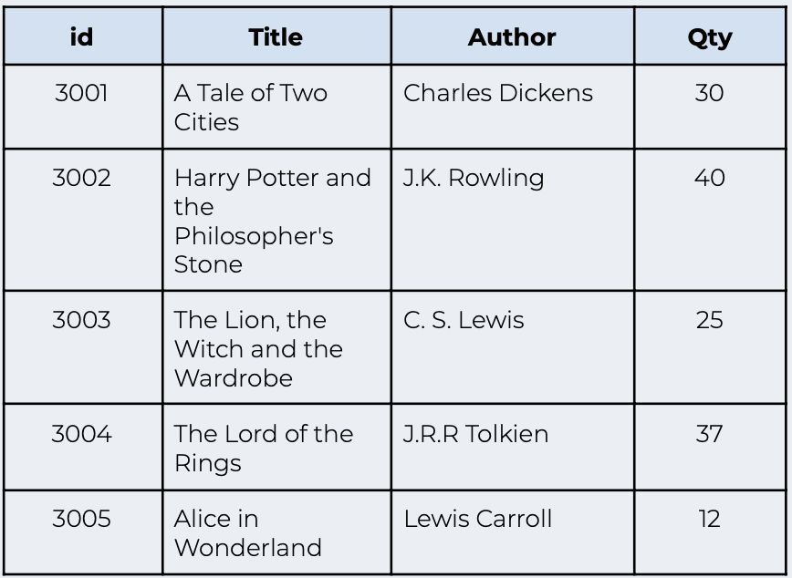

# JDBC HW 

## Follow these steps:

* Create a program that can be used by a bookstore clerk. The program should allow the clerk to:

    * enter new books into the database

    * update book information
    
    * delete books from the database

    * search the database to find a specific book.

* Create a database called ebookstore and a table called books. The table should have the following structure:

* Populate the table with the above values. You can also add your own values if you wish.

* The program should present the user with the following menu:

     
                1. Enter book  
                2. Update book  
                3. Delete book  
                4. Search books  
                0. Exit 

     

* The program should perform the function that the user selects. The implementation of these functions is left up to you.

* Feel free to add more functionality and complexity to the program. This is your chance to show off all the programming concepts you have learnt so far!